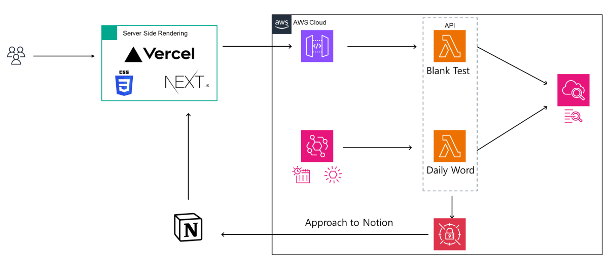

## 보카볶아 + velog bedge

웹에서는 notion에서 영단어를 불러오는 영단어 테스트를 제공하고  
API로 velog 뱃지를 불러올 수 있습니다.

---

### velog bedge API

velog ID를 넣음으로 사용할 수 있습니다.

#### version 1
```powershell
[](https://velog.io/@벨로그 ID)
```
[](https://velog.io/@hwangrock1220)

#### version 2
```powershell
[](https://velog.io/@벨로그 ID)
```
[](https://velog.io/@hwangrock1220)

---

### 개발 배경

###### 기술
동아리 세미나에서 서버리스라는 단어를 듣고 들은 생각은 "서버리스 프로젝트에 백엔드는 필요 없나?" 였습니다.  
이런 궁금증을 해소하고 싶어서 직접 서버리스를 공부하고 해보기로 마음 먹었습니다.  
<br>

###### 영어
영어는 꺼내쓰는 연습을 해야 느는 분야라고 생각합니다.  
그러기에 논문이나 공식 문서같은 곳에서 읽다가 모르는 단어를 다시 꺼내 쓰기 위해서 저만의 영단어 테스트 프로젝트를 만들어보기로 했습니다.  
</br>
기존의 영단어 테스트는 영단어 뜻과 한글 뜻이 정확히 일치해야 하기에 객관식으로 보는 경우가 많았으나 이를 주관식으로 쓰기 위해 테스트 끝나고 사용자 제출과 정답을 보여줘서 사용자에게 재시험을 선택하는 방법으로 선택했습니다.

---

### 아키텍처
목적이 수익 창출이 아니라 학습 보조이므로 성능보다는 무료에 집중해서 설계했습니다.  

